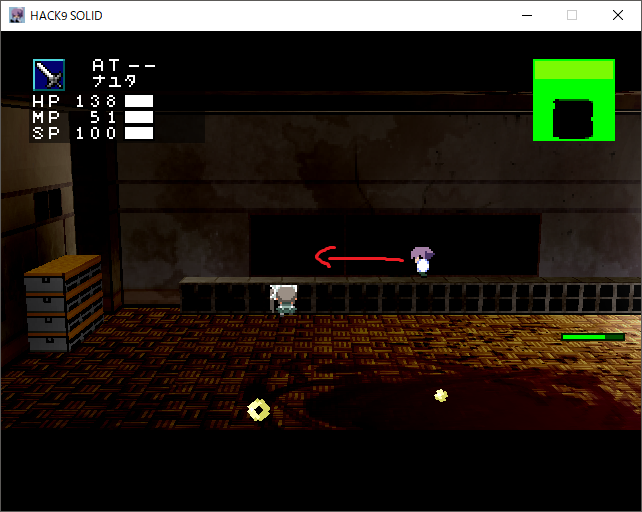
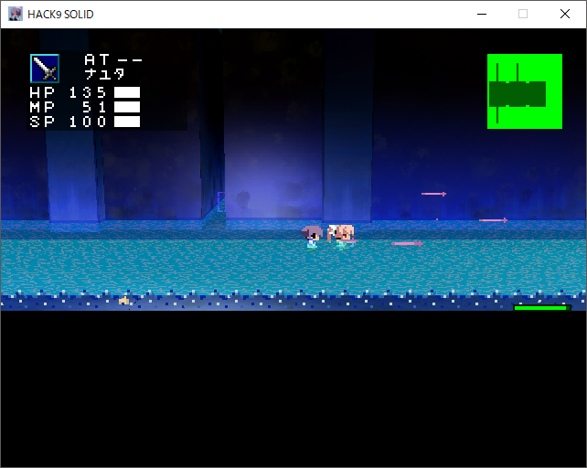
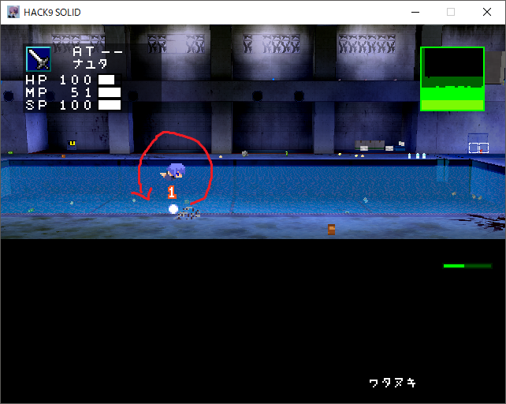

---
pagetitle: ざっぱな置き場
css: ../style.css
...

<header class = "header">
# Ghost9solid {#G9s}
#### Ghost9solidの攻略チャートです.

</header>

[ << 戻る ](searcher.html) [ indexへ ](index.html) [  進む >> ](fool.html)

## [キケンヲオカスモノ]

### ① 一番合戦を倒す
#### ● 大目標：一番合戦を倒す
* カガクシツのポータルから直進、教室に入りポニテのやべーやつを倒す
    * 一番合戦：HP40
        * キョウシツに入ったときにヤカラと戦っている。ヤカラからもダメージを受けるので、リセマラしていい感じに一番合戦のHPを減らしておくと楽。
        * ダメージが3と痛い。ロッカーの上で相手と高さを1つズラして戦うと楽。
         
        <a href="#" id="view1" onClick="t_view(1);return false;">こんなかんじ</a>
        <a href="#" id="hidden1" onClick="t_hidden(1);return false;" style="display:none;">隠す</a>
        

            
            

            こんなかんじで。あとは前後しながらダンビラブンブンで勝てる。相手が登ってきたら降りる。
            

        

        * ショベルを決めて逃げるを繰り返せばわりと簡単に行けるはず
* 倒すと鍵を落とす
    * 地下倉庫(1階職員室の隣)に行けるようになる

### ② 天明屋を倒す
#### ● 大目標：天明屋を倒し、屋上の鍵を手に入れる
* 1階職員室の隣、チョスイジョウの奥にいるツインテのやべーやつを倒す
    * 天明屋：HP50
        * ボウガンが痛い。がわりと簡単に見切れるはず。
        * 相手の背中を狙う感じで斜めに移動すれば問題なく倒せるはず。
         
        <a href="#" id="view2" onClick="t_view(2);return false;">こんなかんじ</a>
        <a href="#" id="hidden2" onClick="t_hidden(2);return false;" style="display:none;">隠す</a>
        

            
            

            攻撃後頑張って敵の背後を取る感じに動く。ジャンプ多用すれば結構当たらない
            

        

* 入り口手前、階段の近くからソウコAへ入り、イベントマスで屋上の鍵を入手する

#### ○ 小目標1:タイソウギを手に入れる
* ソウコA入って左手側に壊せる壁
* スコップで破壊してヌノ？(タイソウギ)を回収する。
    * 体操着：DF+1
        * 意外とでかい

### ③ 屋上へ行く
#### ● 大目標：屋上へ ＆ 起動ディスク3の入手
* 帳簿からFDを取り出す。
* 北大路がいたところまで行く。倒れていたとこの近くにイベントマスでFDをFD(起動ディスク3)に変化させる。
* 屋上でイベントを見る

#### ○ 小目標: テツボウ?(タカエダ)を手に入れる
* 入り口からプール方面をまっすぐ行くとなんかあるのでとっとく。
    * サブ火力として使えんこともない

### ④ 体育館のロックを解除する
#### ● 大目標:体育館のロックを解除する
* さっきの起動ディスク3と、帳簿から空のFDを1枚だけと、ショベルを持ってチョスイジョウへ
    * FDはチョスイジョウのソウコでもう一個手に入るのでそれで事足りる
* FDに起動ディスク2を入れる
* 起動ディスク2があった部屋の反対側の通路からソウコBへ
* FDに起動ディスク1を入れる
    * 起動ディスク1,2,3は以下の場所。
        * 1:ソウコB入って入り口から2つ目に近いとこ
        * 2:天明屋がいたところからシャッターを見て右側のソウコAのパソコン
        * 3:屋上
* ついでにソウコBの入り口すぐ近くの部屋、ソウコCに入りイベントマスで3番目のHDDを抜き取る(後々使う)
* 3匹の黄色いやつをスルーして蜘蛛の巣っぽいのがある部屋まで行く
* FDを、正面から見て 起動ディスク1,3,2の順番にくぼみに置く
* 5匹の黄色いのをスルーして一番奥の通路の一番奥の部屋に向かう
* 本棚の壁をショベルで壊せるので壊してそこを進んでコウチョウシツへ
* コウチョウシツからセントリーがある方へ、奥の部屋のイベントマスでタイイクカンのロックを解除する
    * 緑の方へ行くと死ぬ
* マンガブに帰る

### ⑤ 体育館のプール側へ行く
#### ● 大目標：体育館へ行き、プールにいるボスを倒して鍵を取る
* ロウカBの2階、チョスイジョウの入り口の上の入り口からロウカDへ行く
* (帰りでも可)直進して体育館へのポータルを開ける
* ロウカDの男子コウイシツ側の入り口から侵入、スコップで扉を壊して開いてる方の入り口へ
* ボスの四月一日(ワタヌキ)がいる
    * が、スルーしてプールの中の青い大きな銃みたいなの(カタマリ?(FMAS))だけ回収してマンガブで休んで売店で耐久値を回復させておくと楽
* ボスのワタヌキをしばく
    * ワタヌキ：HP100くらい？
        * めっちゃ泳いで円盤投げとクナイ攻撃を繰り返すだけ。
        * ケツ
        * プールサイドでクナイ攻撃をひたすら待って攻撃で勝てる。
         
        <a href="#" id="view3" onClick="t_view(3);return false;">こんなかんじ</a>
        <a href="#" id="hidden3" onClick="t_hidden(3);return false;" style="display:none;">隠す</a>
        

            
            

            自機狙い → ちょっと前進 → クナイ なので、自機狙いの際にちょっと前に飛んでワタヌキの背中側に着地する感じで。
            

        

* 体育館の鍵をゲットする

#### ○ 小目標: Fメイサイをゲットする
* ロウカDから男子コウイシツから破壊できる扉の前くらい
* コミックアイコンのニッキが落ちてるのでそれを拾って使うと開放
    * クビ、ドウ、イチブなどの死体系アイテムを消費して使用する。
    * 一定時間ヤカラから狙われなくなるが速度がゴミなので使えない。
    * あるアイテム入手のフラグ立てに必要になる

### ⑥ 体育館へ行く
#### ● 大目標：体育館へ行き倉庫にいる兵士からとある住所を聞き出す
* さっきもらった鍵でコウイシツで行けなかったほうの入り口からタイイクカンBへ→タイイクカンAへ
* 画面の真ん前にある入口に向かって進んで入るとイベント
* イベント終わったらﾃﾞﾃｲｹｪされるのでもっかい入って兵士から住所を聞き出す。
* マンガブへ帰る

#### ○ 小目標1: FDに起動ディスク4を入れる
* 鉄にヤられた兵士がいたところの近くの入口からタイイクカンBへ移動、入り口近くのパソコンでFDに起動ディスク4を入れる。
* 前に体育館のロックを解除したとこのFDの2番めをコレと交換するとコウチョウシツに行けるようになる
相変わらず緑の方へ行くと即死する(1敗)
* コウチョウシツはタイイクカンのポータルから出たマップの上のマップ。なんか適当に行けるが特に収穫はない。

#### ○ 小目標2: FMASを回収する
* 起動ディスク4が手に入るマップに行く
* 近くに壊せる扉があるので底に入って中央の青いカタマリ回収
    * なくてもいい

#### ○小目標3: ニノマエを倒す
* 松下を助けたトラックの近くの入口へ行くとなんかだるまみたいなのがいる
    * ニノマエ：HP400
        * HPがとにかくおおいし3Dだから当てづらい＆痛いうえに泥武器が微妙。
        * スルーか2周目で良い。
        * もし倒したいならガン逃げしつつ足を狙うと良い。
        * たぶんこの時期を逃したら二度と倒せない

### ⑦ 助けを求めに行く
#### ● 大目標：トラックから移動する
* タンクを持ってコウモンマエまで行く
* 近くの自動車からガソリンをパクる
* トラックを発信させグンカンM1へ、初進入時イベント
* 入り口とちょうど反対側にグンカンM2への入り口があるのでそこの1階のイベントを見る
* ついでに二階の自販機の近くにあるセトヤキ?(ヨウヘンテンモク)を手に入れる(後々使う)。
* マンガブへ

### ⑧ ヤカラ焼き討ち
#### ● 大目標：タイイクカンAでヤカラを一定数倒す
* タイイクカンAでRヤカラがめっちゃ湧くのでぶっ殺す
* 9割くらい倒すとモータルが出るのでぶっ潰す

 <キケンヲオカスモノ> 終了

[ソウサクシャ](searcher.html)へ

<!-- cont -->

<footer class ="footer">

 [top](../index.html) 

</footer>
