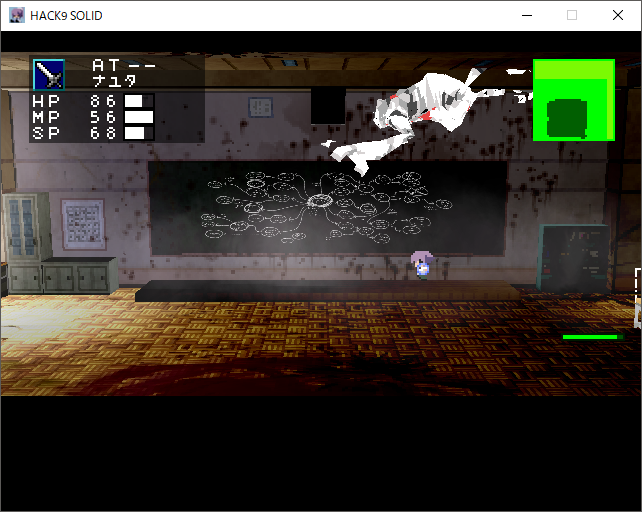
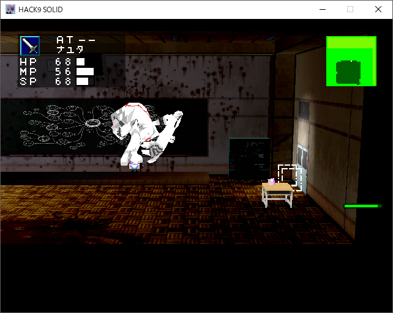
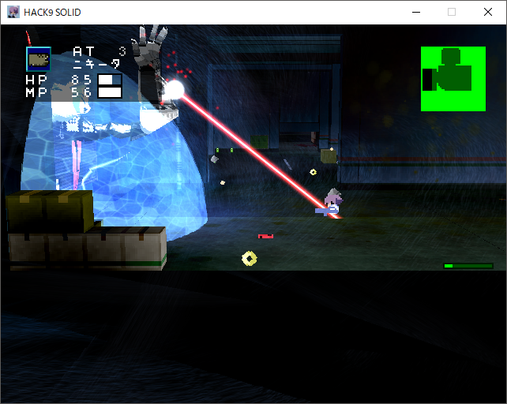
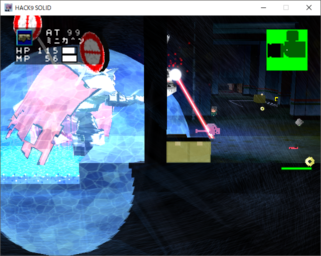
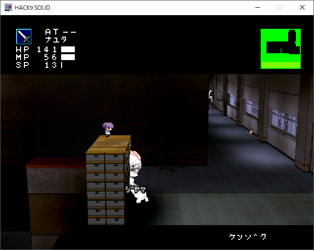
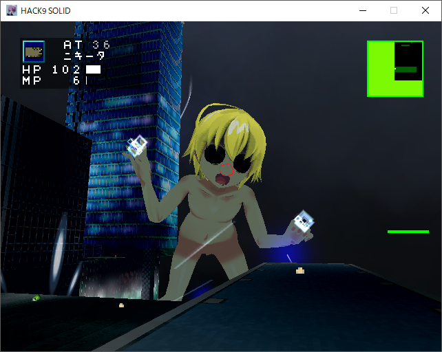
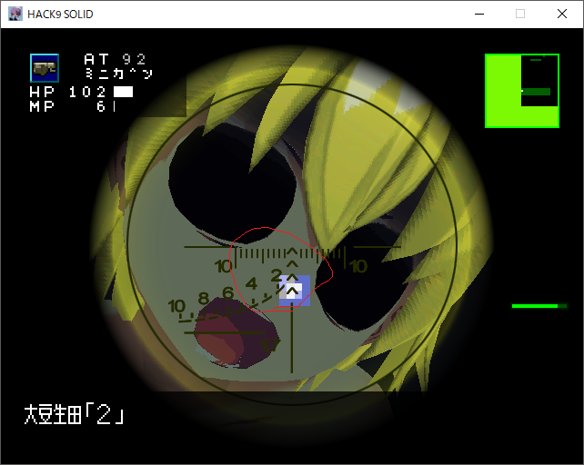
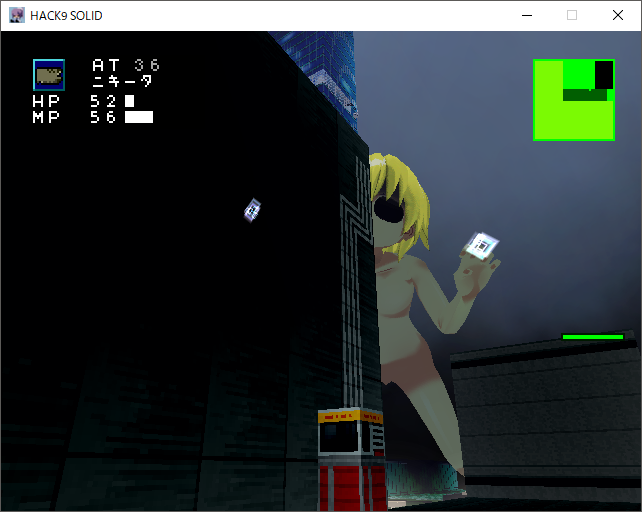

---
pagetitle: ざっぱな置き場
css: ../style.css
...

<header class = "header">
# Ghost9solid {#G9s}
#### Ghost9solidの攻略チャートです.

</header>

[ << 戻る ](destroyer.html) [ indexへ ](index.html)

## [アスヲノゾムモノ]

### ① 鉄を倒す

#### ●大目標： 一番合戦(ガチ)、天明屋（ガチ）、五六(ガチ)、四月一日(ガチ)を倒す

* 一番合戦(ガチ)：HP300 → 1200?
    * 素は省略
    * 地面叩きつけ衝撃波：地面とそこから＋１マス分のダメ判定が出るので、掃除用具入れの上などの2マス以上にすぐ逃げる。
    * 素殴り：停止して範囲の広い殴り。相手が停止したらだいたいヤバい攻撃なので逃げよう。
    * 吸い込み：停止したらこれか素殴りの二択。カソクソウチつけていれば割と余裕に逃げれる。
    * 飛びつき * ４：わりとめんどくさい攻撃。うまく黒板のところに誘導すると若干ハメれる
     
    <a href="#" id="view0" onClick="t_view(0);return false;">こんなかんじ</a>
    <a href="#" id="hidden0" onClick="t_hidden(0);return false;" style="display:none;">隠す</a>
    

        
        
        
黒板に密着する感じで。普通に攻撃を食らうので気休め程度に。

    

* 天明屋（ガチ）：HP200 → 1800?
    * 素殴り：いつもの。シャッターがあるので当たらない
    * 射撃：自機狙い弾を6発打つ。ジャンプしてたら避けれる
    * ジャンプ → 衝撃波：シャッターで当たらない
    * ビーム：一番やばいけど一番簡単なやつ。天明屋付近にバリアが生成され、クソつよ追尾ビームが中～遠距離に判定が発生する。バリアにできるだけ近寄るとビームの当たり判定がなくなるのですぐ近寄ろう
     
    <a href="#" id="view1" onClick="t_view(1);return false;">このくらいの距離で。</a>
    <a href="#" id="hidden1" onClick="t_hidden(1);return false;" style="display:none;">隠す</a>
    

        
        
        
バリアに当たるとめちゃノックバックさせられるので注意。

    

    * シャッターがあるのでクソ楽な部類。ビームは初見ビビるが性質を知ったら楽。

* 五十六(ガチ)：600 → 2600?
    * 第一形態：
        * サイコダガーがクソめんどくさいのでMDLTなどでマッハで削るの推奨
    * 第二形態：パッチでパターンが変わった?
        * OKサイン：炎の玉おそらく地面にしか判定がナイが今は判定がない
        * チョップ：範囲が狭い
        * グー：範囲が狭い
        * 雷：ソクシになったが範囲が狭いので安全運転してれば当たらない
        * 全体的にケンダマと同じ感覚で行けばノーダメでも余裕で倒せる

* 四月一日(ガチ)：
    * 第一：省略
    * 第二：固定型のボス。
        * ミサイルは刀で迎撃。
        * 基本ぐるぐる廻り始めたら逃げるが吉
        * 遠距離から撃ってればいつか死ぬ

#### ○ 小目標1 :眷属からのドロップ品を集める
* 学校内のウサミミ眷属
    * MDLT(必須)、ヒロミツ(刀)
    * 判定がでかいので壁を挟んで刀で切ると楽に倒せる
     
    <a href="#" id="view2" onClick="t_view(2);return false;">こんなかんじ</a>
    <a href="#" id="hidden2" onClick="t_hidden(2);return false;" style="display:none;">隠す</a>
    

        
        
カガクシツ付近のケンゾクがおすすめ

    

* タイイクカンの銃眷属
    * エイドトピア(自作エイドの回復量2倍)、タテナシ(DF+5)
    * 攻撃は単調かつ弱いのでさっさと倒す。泥がうまい、うますぎる

* ドームみたいなやつ
    * RPG-V4(ニキータでいい)、M735A1(39ダメ、MAX10)
    * M735A1はぜひ回数を増やして使いたい。

* 手みたいなの
    * カルワザノタビ(壁を登れるようになる)
    * これがあるとダンビル前から日南ビル16Fに行ける
    * 真ENDでとあるアイテムの回収にも必要

#### ○ 小目標2: 日南ビル16Fで諸々を回収する
* カルワザノタビを回収する
* 日南ビルをひたすら登る
* ガラス部屋が見えてきた付近の入り口から入って諸々を回収
    * 中性子爆弾：すごい
    * コンゴウウデワ：ダメ2倍つよい
    * ストロンチウム・ストロチアン：うまい

================================================

### ☆ エンディング分岐

#### ノーマルEND
* 特に何もせず小鳥遊戦に行く
* 天下五剣が足りない
    * 1週目はこちらを推奨。というのも真ENDの方は結構敵が強くて苦戦しがち

#### 真END
* [こちら](trueend.html)

================================================

### ② ダンビル前で小鳥遊を倒す
* 小鳥遊：HP???
    * コレまでの奴らを倒せたなら普通にしていれば倒せるはず。この後連続戦になるのでエイドはいっぱい持っていこう。
        * リペアは持ってかなくてもいいというか持っていくな、あとでリペアMAXが７こくらいはもらえる
    * ハンマーと刀攻撃の二種のみ。
        * ハンマー：叩きつけ。一発17ダメージなので食らっては行けない（戒め）。稀にｺﾞｺﾞｺﾞｺﾞみたいな音の後にソクシする白い爆発に移行する事があるので注意。
        * 刀：ダンビラブンブン。
        * 次元流なんちゃら：突撃するだけなのでジャンプでOK
        * かっこいいモーションから瞬間移動してハンマー：自機の後ろにワープするっぽいので動き続けてればあたらない。
    * 泥がハンマーとコガラスマルのどっちか.ランダムでドロップ?

### ③ パツキン巨人
#### ● 大目標：パツキンを倒す
* 巨人を倒す
    * ｵｵﾏﾐﾕｳﾀﾞ(全裸)：HP???
        * ほとんどジャマーで防がれるが目付近、詳しくは鼻らへんに判定がある。ミニガンとかドラグノフとかで狙って倒すといい。
         
        <a href="#" id="view4" onClick="t_view(4);return false;">鼻らへん</a>
        <a href="#" id="hidden4" onClick="t_hidden(4);return false;" style="display:none;">隠す</a>
        

            
            
            
赤丸らへんを狙う

        

        * 周りのロボットはミサイル以外は怖くないのでスルー推奨。
        * この辺にいると大体の攻撃が当たらないのでじっくり狙って倒そう
         
        <a href="#" id="view3" onClick="t_view(3);return false;">ここ</a>
        <a href="#" id="hidden3" onClick="t_hidden(3);return false;" style="display:none;">隠す</a>
        

            
            
狩屋のとこから巨人を見てすぐ右側へ、自販機の近く。

        

        * 隕石：めちゃくちゃ範囲が広い攻撃
        * 緑色のガス？：食らったらヒンシ(体力が強制的に1になる)
        * 吸い込み：めちゃ吸う。一番痛い。3Dモードだと吸い込みが発生しない？
        * 雷：だいたい当たらない
* ダンビル前に入ったとこのビルをうまいこと登って行くと狩屋がリペアMAXを無料配布してる
    * 登り方は、改札前の階段 → 街灯 →　街灯 → 駅の壁 で壁のくぼみをのぼっていく感じで
    * カルワザノタビがあるならそれで
* 真ENDに行きたい場合、リペアMAXを2個ほど温存して置くと後が楽になる。
* イベント回収
* ED

[TRUE END >> ](trueend.html)

<!-- cont -->

<footer class ="footer">

 [top](../index.html) 

</footer>
