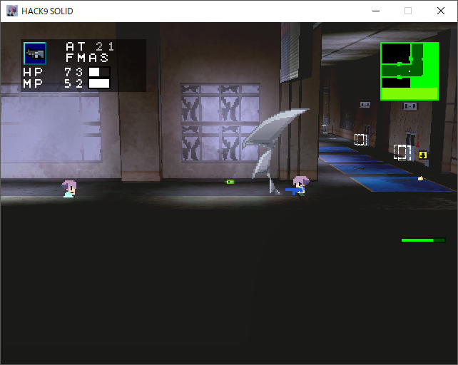

---
pagetitle: ざっぱな置き場
css: ../style.css
...

<header class = "header">
# Ghost9solid {#G9s}
#### Ghost9solidの攻略チャートです.

</header>

 [ indexへ ](index.html) [  進む >> ](emergency.html)

## [ソウサクシャ]

### ① 仲間を回収する
#### ● 大目標：五十鈴川、小鳥遊、北大路の回収
* ロウカB方面2階、入り口近くのトショシツ(2階)で五十鈴川を回収
* ロウカB方面2階、男子トイレ奥で小鳥遊を回収。
* マンガブから崖方向へ、階段を上り、ロウカA方面3階へ、カガクシツ方面へ、ロウカC方面へ、直進、階段を上り、瀕死の北大路を回収

#### ○ 小目標1 : マンガブへのポータルを開く
* 崖方面ロウカA方面3階、カガクシツのクモを倒す.
    * でっかいクモ：HP20くらい

        * このゲーム基本的に3Dの敵の当たり判定がクソ厳しい。
        なので焦らずにゆっくりと、ジャンプして胴体をダンビラで攻撃する感じを繰り返す.
        わりと余裕で行けるはず。

        * ボスは部屋から出ると状態がリセットされるので繰り返すことで無限にアイソトープが手に入り武器を無限強化できる
            * が、一周目では手間なので二週目など推奨

* イベントでカガクシツからマンガブへのポータルが開く

#### ○ 小目標2 : ダンビラの回収
* 崖方面ロウカA方面2階の緑色の教室でカタナ?(ダンビラ)を回収する 
    * ロッカーのところ、キュウゴバコ(白い箱)も一緒に回収する(エイド作成時に重宝する)。

        今回のタンビラというか刀系の武器は判定がクソ強なので最後まで重宝する。序盤のお供になるので要回収。

 <!-- one -->

### ② 北大路の治療薬を作る

#### ● 大目標：エイドを作成し北大路に付与する
* クッキーチェイドとボックスと食べ物を探す
    * クッキーチェイド：
        * 黒服(教師)のヤカラのレアドロ、または 図書室1階入って直進窓際の机の赤い本
        * 使用すると、SP POWERに*エイドが追加される
    * ボックス：
        * そこらへんに落ちてる教科書とかコミックを合計5個用意
        * カガクシツの穴に入れて合成する
    * 食べ物：
        * てきとーに食えそうなもの
* ボックスを作成後,アイテム欄からボックスを選択し食べ物とニコイチする
    * マンガブの店で買ってもいいがさすがに作ったほうがあとあと良い
* エイドができるので持った状態で北大路にあげる

#### ○ 小目標1：職員室でショベルとタンクを回収する
* 階段を降りて時計や下駄箱っぽいものがある方面、緑のまだ入れない扉の近くのショクインシツ内
* 赤い容器とスコップっぽいのを回収
    * 赤い容器(タンク)は後々使う
    * スコップは壁破壊と序盤の火力なので必須

#### ○ 小目標2：トショシツ(1階)でヒャッカジテンを回収する
* ロウカB方面、一階のトショシツへ。
* 段ボールがある本棚の近く、ヒャッカジテンを回収する
    * ヒャッカジテンを使うとSPに*カンテイが追加される

<!-- sec -->

### ③ 救助を待つ→トラックへ松下回収
#### ● 大目標：松下を回収してマンガブに戻る
* ロウカB方面1階から下駄箱へ、コウモンマエへ
* 白いトラックの荷台の入り口からトラックナイへ、松下回収
    * ガディはスルーで良い

#### ○ 小目標1：ハモノ?(ナイフ+1)を回収
* 松下を回収したトラック近くの青い屋根の上のハモノ
    * ナイフ+1はダメージが2なのでヤカラを2発で倒せるようになる
    * が攻撃範囲が狭いのでぎリスキー正直ダンビラのままでもいい

#### ○ 小目標2：オウキュウテアテを手に入れる
* 白いヤカラ(患者)のレアドロ(L5とか表示されるやつ)
    * SP10消費してHP10回復。
    * 地味にありがたいのでとっとくと吉。無理して泥を狙わなくても、見かけたら毎回倒せばそのうち泥る

<!-- thri -->

### ④ 小鳥遊が怪しい
#### ● 大目標：図書室で諸々を回収する
* トショシツ1階のイベントマスで「100キロ近い凶器」を確認する
* 窓側中央のケイタイデンワを回収する
* 五十鈴川に話しかける
* [<キケンヲオカスモノ>](emergency.html)発生

<!-- for -->

[キケンヲオカスモノ](emergency.html) を終了させると次が出る

<!-- five -->

### ⑤ ヨイナラを倒す
#### ● 大目標：ヨイナラを倒す
* 体育館のポータルの近くにおるガキを倒す
    * ヨイナラ：HP190？
        * 6ダメージとかなり痛い。が、攻撃範囲に制限があるので遠距離からぺちぺちしてればよい
        * 地面潜って自機狙いの際に刀でブンブンもアリ
         
        <a href="#" id="view3" onClick="t_view(3);return false;">このくらいの距離</a>
        <a href="#" id="hidden3" onClick="t_hidden(3);return false;" style="display:none;">隠す</a>
        

            
            

            このくらいなら当たらない。
            

        

<!-- six -->

### ⑥ イベントの回収～
* イベントの回収のみなので略

<!-- sev -->

[ソウサクシャ終了]

[ オロカモノノセンタク　へ　>> ](fool.html)

<!-- cont -->

<footer class ="footer">

 [top](../index.html) 

</footer>
